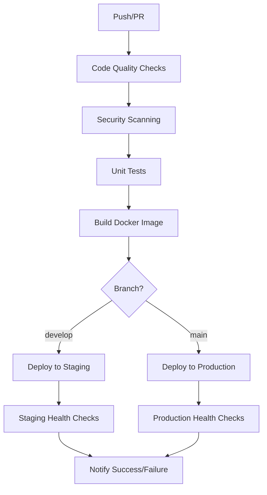

# DataBot Deployment Guide

This guide covers the complete CI/CD pipeline and deployment process for DataBot.

## Table of Contents

1. [Overview](#overview)
2. [Prerequisites](#prerequisites)
3. [CI/CD Pipeline](#cicd-pipeline)
4. [Environment Setup](#environment-setup)
5. [Deployment Process](#deployment-process)
6. [Monitoring & Maintenance](#monitoring--maintenance)
7. [Troubleshooting](#troubleshooting)

## Overview

DataBot uses a comprehensive CI/CD pipeline with:
- **Automated testing** on every push and PR
- **Security scanning** with Trivy
- **Multi-stage deployments** (staging → production)
- **Zero-downtime deployments** with health checks
- **Automatic rollbacks** on failure
- **Monitoring and alerting**

## Prerequisites

### Repository Setup

1. **GitHub Repository Secrets**
   ```
   STAGING_SSH_KEY          # SSH private key for staging server
   STAGING_USER             # SSH username for staging server  
   STAGING_HOST             # SSH hostname for staging server
   PRODUCTION_SSH_KEY       # SSH private key for production server
   PRODUCTION_USER          # SSH username for production server
   PRODUCTION_HOST          # SSH hostname for production server
   SLACK_WEBHOOK_URL        # Slack webhook for notifications
   ```

2. **Server Requirements**
   - Ubuntu 20.04+ or similar Linux distribution
   - Docker and Docker Compose installed
   - SSH access configured
   - Minimum 2GB RAM, 20GB storage

3. **External Services**
   - Discord Bot Token (separate bots for staging/production)
   - YouTube Data API v3 Key
   - PostgreSQL credentials
   - Redis configuration

## CI/CD Pipeline

### Pipeline Stages



### Automated Processes

1. **Code Quality**
   - Black formatting check
   - Flake8 linting
   - MyPy type checking
   - Test coverage reporting

2. **Security**
   - Trivy vulnerability scanning
   - Dependency security checks
   - Container image scanning

3. **Testing**
   - Unit tests with pytest
   - Integration tests with real services
   - Coverage reporting to Codecov

4. **Building**
   - Multi-platform Docker builds (amd64, arm64)
   - Image caching for faster builds
   - Automatic tagging and versioning

5. **Deployment**
   - Zero-downtime rolling deployments
   - Automatic health checks
   - Rollback on failure
   - Slack notifications

## Environment Setup

### 1. Staging Environment

```bash
# 1. Clone repository on staging server
git clone https://github.com/yourusername/databot.git /opt/databot
cd /opt/databot

# 2. Create environment file
cp env.staging.example .env.staging
nano .env.staging  # Edit with staging credentials

# 3. Create required directories
mkdir -p logs backups monitoring

# 4. Initial deployment
./scripts/deploy.sh deploy staging
```

### 2. Production Environment

```bash
# 1. Clone repository on production server
git clone https://github.com/yourusername/databot.git /opt/databot
cd /opt/databot

# 2. Create environment file
cp env.production.example .env.production
nano .env.production  # Edit with production credentials

# 3. Create required directories
mkdir -p logs backups monitoring

# 4. Initial deployment
./scripts/deploy.sh deploy production
```

### 3. GitHub Actions Setup

1. **Enable GitHub Container Registry**
   - Go to repository Settings → Packages
   - Enable "Improved container support"

2. **Configure Branch Protection**
   - Require status checks before merging
   - Require up-to-date branches
   - Include administrators

3. **Environment Protection Rules**
   - Staging: Allow deployment from `develop` branch
   - Production: Require approval + allow only from `main` branch

## Deployment Process

### Development Workflow

```bash
# 1. Create feature branch
git checkout -b feature/new-feature

# 2. Make changes and test locally
docker-compose up -d
pytest tests/

# 3. Commit and push
git add .
git commit -m "Add new feature"
git push origin feature/new-feature

# 4. Create pull request
# → CI pipeline runs automatically
# → Code review and approval
# → Merge to develop

# 5. Automatic staging deployment
# → Triggers on push to develop branch
# → Runs full test suite
# → Deploys to staging environment
# → Runs health checks

# 6. Production deployment
git checkout main
git merge develop
git push origin main
# → Triggers production deployment
# → Requires manual approval
# → Zero-downtime rolling deployment
```

### Manual Deployment

```bash
# Deploy specific version to staging
./scripts/deploy.sh deploy staging v1.2.3

# Deploy to production
./scripts/deploy.sh deploy production v1.2.3

# Health check
./scripts/deploy.sh health production

# View logs
./scripts/deploy.sh logs production bot

# Rollback if needed
./scripts/deploy.sh rollback production
```

### Version Management

Versions are automatically tagged based on:
- `latest` - Latest commit on main branch
- `develop` - Latest commit on develop branch
- `main-<sha>` - Specific commit SHA on main
- `v1.2.3` - Manual git tags

## Monitoring & Maintenance

### Health Monitoring

1. **Application Health Checks**
   - Database connectivity
   - Redis availability
   - Discord bot status
   - Background task processing

2. **Infrastructure Monitoring**
   - Container health status
   - Resource usage (CPU, memory, disk)
   - Network connectivity
   - Log aggregation

3. **Grafana Dashboards**
   - Access: `https://your-domain.com:3000`
   - Default credentials: admin / (see env file)
   - Pre-configured dashboards for system metrics

### Backup Strategy

1. **Automated Database Backups**
   - Daily PostgreSQL dumps
   - Retained for 30 days
   - Stored in `/opt/databot/backups/`

2. **Configuration Backups**
   - Environment files
   - Docker compose configurations
   - SSL certificates

3. **Image Backups**
   - Docker images tagged for rollback
   - Automatic cleanup of old images

### Log Management

1. **Log Locations**
   ```
   /opt/databot/logs/bot.log          # Application logs
   /var/lib/docker/containers/        # Container logs
   /opt/databot/logs/deployment.log   # Deployment logs
   ```

2. **Log Rotation**
   - Automatic rotation at 10MB
   - 5 backup files retained
   - Structured JSON logs in production

3. **Log Analysis**
   - Use `docker-compose logs` for real-time logs
   - Grep/search through rotated log files
   - Consider ELK stack for large deployments

## Troubleshooting

### Common Issues

1. **Deployment Failures**
   ```bash
   # Check deployment logs
   ./scripts/deploy.sh logs production
   
   # Check container health
   docker-compose -f docker-compose.production.yml ps
   
   # Manual health check
   ./scripts/deploy.sh health production
   
   # Rollback if necessary
   ./scripts/deploy.sh rollback production
   ```

2. **Database Issues**
   ```bash
   # Check database connectivity
   docker-compose -f docker-compose.production.yml exec bot \
     python -c "from app.infrastructure.db import check_database_health; print(check_database_health())"
   
   # Access database directly
   docker-compose -f docker-compose.production.yml exec postgres \
     psql -U databot -d databot
   
   # Restore from backup
   docker-compose -f docker-compose.production.yml exec postgres \
     psql -U databot -d databot < backups/databot_production_20231201_120000.sql
   ```

3. **Redis Issues**
   ```bash
   # Check Redis connectivity
   docker-compose -f docker-compose.production.yml exec redis redis-cli ping
   
   # Clear cache if needed
   docker-compose -f docker-compose.production.yml exec redis redis-cli flushall
   ```

4. **Discord Bot Issues**
   ```bash
   # Check bot logs
   docker-compose -f docker-compose.production.yml logs bot
   
   # Restart bot service
   docker-compose -f docker-compose.production.yml restart bot
   
   # Check Discord token validity
   # Verify bot permissions in Discord Developer Portal
   ```

### Emergency Procedures

1. **Complete Service Outage**
   ```bash
   # Stop all services
   docker-compose -f docker-compose.production.yml down
   
   # Check system resources
   df -h
   free -m
   
   # Restart services
   docker-compose -f docker-compose.production.yml up -d
   ```

2. **Database Corruption**
   ```bash
   # Stop application
   docker-compose -f docker-compose.production.yml stop bot celery-worker
   
   # Restore from latest backup
   # (see database backup procedures above)
   
   # Restart application
   docker-compose -f docker-compose.production.yml start bot celery-worker
   ```

3. **Security Incident**
   ```bash
   # Immediately stop all services
   docker-compose -f docker-compose.production.yml down
   
   # Rotate all secrets (Discord tokens, API keys, passwords)
   # Update environment files
   # Review logs for suspicious activity
   # Deploy with new credentials
   ```

### Performance Optimization

1. **Database Optimization**
   - Monitor slow queries
   - Add indexes as needed
   - Regular VACUUM operations
   - Connection pool tuning

2. **Cache Optimization**
   - Monitor cache hit rates
   - Adjust TTL values
   - Redis memory management
   - Cache warming strategies

3. **Scaling Options**
   ```bash
   # Scale Celery workers
   docker-compose -f docker-compose.production.yml up -d --scale celery-worker=3
   
   # Scale bot instances (if supporting multiple guilds)
   docker-compose -f docker-compose.production.yml up -d --scale bot=2
   ```

## Security Best Practices

1. **Server Security**
   - Regular security updates
   - SSH key-based authentication
   - Firewall configuration
   - Regular backup testing

2. **Application Security**
   - Regular dependency updates
   - Security scanning in CI/CD
   - Environment variable encryption
   - Input validation and sanitization

3. **Monitoring and Alerting**
   - Failed login attempts
   - Unusual resource usage
   - Service availability
   - Error rate monitoring

This deployment guide provides a complete framework for deploying and maintaining DataBot in production environments with high availability and reliability.
